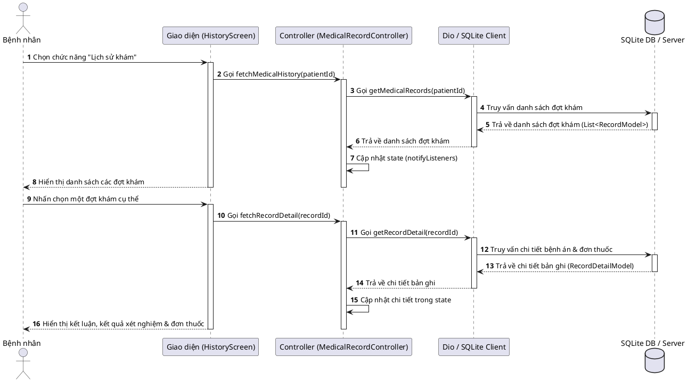
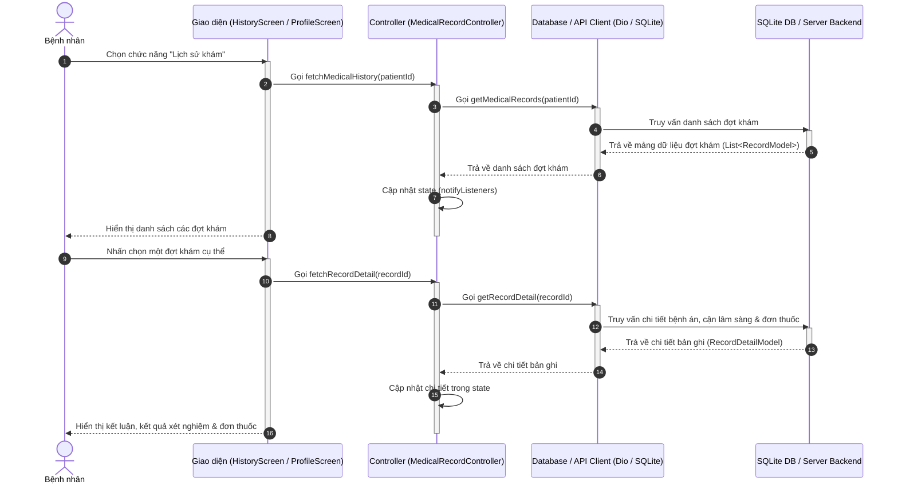
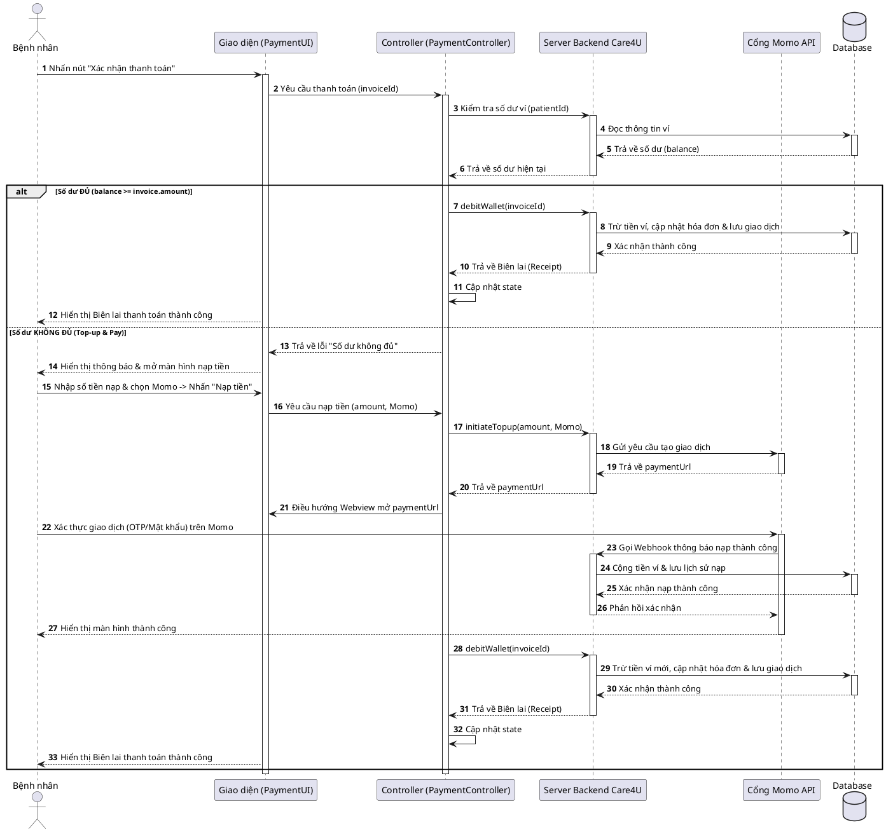
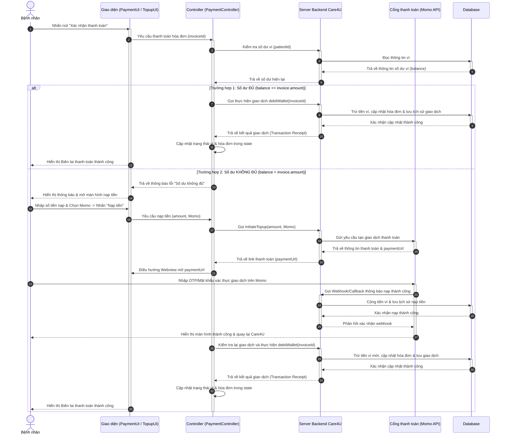

# Sơ đồ tuần tự (Sequence Diagram) - Đồ án Care4U

Tài liệu này chứa các sơ đồ tuần tự (Sequence Diagram) chi tiết cho 2 chức năng được giao:
1. **Xem Hồ sơ y tế & Kết quả khám** (Nguyễn Vương Hồng Vỹ)
2. **Thanh toán điện tử - Ví Care4U** (Nguyễn Thành Danh)

Để giải quyết vấn đề không mở được định dạng Mermaid, tài liệu này cung cấp **cả 2 định dạng mã: Mermaid và PlantUML**, kèm theo hướng dẫn sử dụng các trang web thay thế miễn phí, trực quan và không lỗi.

---

## CÁC TRANG WEB THAY THẾ ĐỂ VẼ/XUẤT SƠ ĐỒ (KHÔNG CẦN CÀI ĐẶT)

Nếu không sử dụng được Mermaid Live Editor, bạn hãy sử dụng các trang sau:
1. **SequenceDiagram.org** (Khuyên dùng - Cực kỳ mượt và dễ dùng):
   * URL: https://sequencediagram.org/
   * Cách dùng: Truy cập trang web, copy toàn bộ mã trong phần **Mã PlantUML** bên dưới và dán vào khung soạn thảo bên trái. Sơ đồ sẽ được tự động vẽ trực quan bên phải ngay lập tức. Bạn có thể nhấn **Export** trên thanh menu để tải ảnh PNG/SVG về máy.
2. **PlantUML Online Server**:
   * URL: http://www.plantuml.com/plantuml/
   * Cách dùng: Truy cập trang web, dán mã PlantUML vào ô văn bản và nhấn **Submit**. Trang web sẽ trả về file ảnh sơ đồ để bạn tải về.
3. **Draw.io (diagrams.net)**:
   * URL: https://app.diagrams.net/
   * Cách dùng: Tạo một file vẽ mới, chọn menu **Arrange** -> **Insert** -> **Advanced** -> **PlantUML...** (hoặc **Mermaid...**), dán đoạn mã tương ứng vào và nhấn **Insert**. Draw.io sẽ tự vẽ thành các đối tượng kéo thả để bạn chỉnh sửa tùy ý.

---

## 1. Sơ đồ tuần tự: Xem Hồ sơ y tế & Kết quả khám (Nguyễn Vương Hồng Vỹ)

### Mã PlantUML (Dán vào sequencediagram.org hoặc PlantUML Server):

### Mã Mermaid (Dự phòng):

---

## 2. Sơ đồ tuần tự: Thanh toán điện tử - Ví Care4U (Nguyễn Thành Danh)

### Mã PlantUML (Dán vào sequencediagram.org hoặc PlantUML Server):

### Mã Mermaid (Dự phòng):

