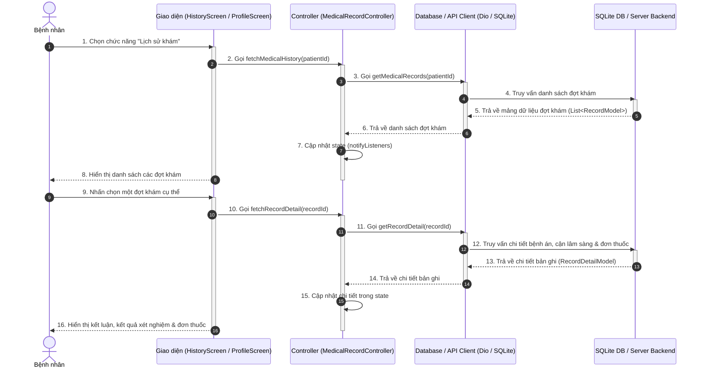
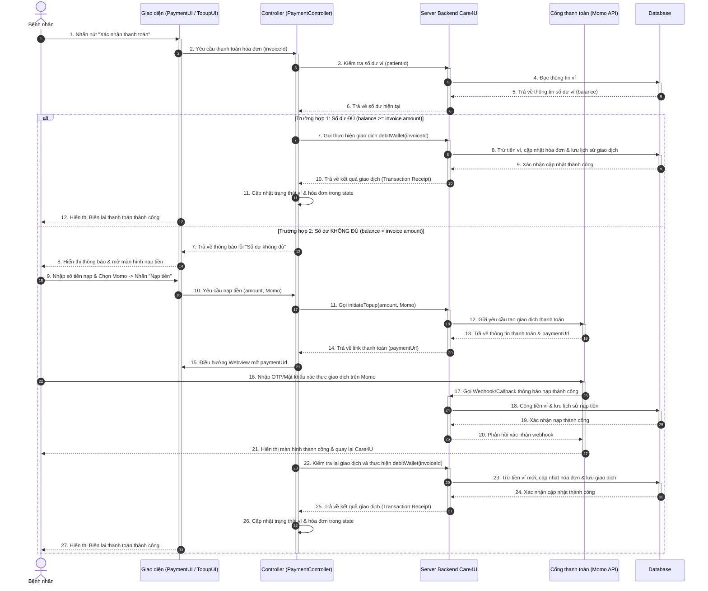

# Sơ đồ tuần tự (Sequence Diagram) - Đồ án Care4U

Tài liệu này chứa các sơ đồ tuần tự (Sequence Diagram) chi tiết cho 2 chức năng được giao:
1. **Xem Hồ sơ y tế & Kết quả khám** (Nguyễn Vương Hồng Vỹ)
2. **Thanh toán điện tử - Ví Care4U** (Nguyễn Thành Danh)

Các sơ đồ được vẽ bằng mã **Mermaid** để bạn có thể dễ dàng sao chép trực tiếp vào báo cáo, hoặc xuất ra file ảnh (PNG/SVG) thông qua các công cụ trực quan (như Draw.io, Mermaid Live Editor, hoặc Markdown Viewer).

---

## 1. Sơ đồ tuần tự: Xem Hồ sơ y tế & Kết quả khám (Nguyễn Vương Hồng Vỹ)

### Mô tả luồng hoạt động:
1. **Bệnh nhân** mở màn hình *Lịch sử khám bệnh* (History Screen) trên ứng dụng di động.
2. Giao diện (UI) yêu cầu **Controller** tải danh sách lịch sử khám bệnh của người dùng.
3. **Controller** gọi phương thức từ lớp **Client (Dio / Database)** để truy xuất dữ liệu.
4. **Client** gửi truy vấn đến cơ sở dữ liệu nội bộ **SQLite (sqflite)** hoặc gọi API của **Server Backend** nếu có kết nối mạng.
5. **SQLite/Server** trả về danh sách các đợt khám (mã đợt khám, ngày khám, tên bác sĩ, chẩn đoán sơ bộ).
6. **Controller** cập nhật trạng thái giao diện (State Management).
7. **UI** hiển thị danh sách đợt khám trực quan cho bệnh nhân.
8. **Bệnh nhân** nhấn chọn vào một đợt khám cụ thể để xem chi tiết.
9. **UI** yêu cầu **Controller** lấy thông tin chi tiết đợt khám y tế được chọn.
10. **Controller** thông qua **Client** truy vấn thông tin chi tiết (kết luận chẩn đoán, các chỉ số sinh hiệu, kết quả cận lâm sàng như xét nghiệm máu/siêu âm, và toa thuốc).
11. **SQLite/Server** trả về toàn bộ dữ liệu chi tiết của bệnh án điện tử.
12. **Controller** cập nhật trạng thái UI.
13. **UI** hiển thị đầy đủ thông tin chẩn đoán, chỉ số xét nghiệm và đơn thuốc cho bệnh nhân.

### Sơ đồ Mermaid:

---

## 2. Sơ đồ tuần tự: Thanh toán điện tử - Ví Care4U (Nguyễn Thành Danh)

### Mô tả luồng hoạt động:
Sơ đồ mô tả luồng thanh toán hóa đơn (phí đặt lịch hoặc mua đơn thuốc) bằng **Ví điện tử Care4U**. Hệ thống hỗ trợ tự động kích hoạt luồng **Nạp tiền (Top-up)** nếu số dư ví của bệnh nhân không đủ để giao dịch.

1. **Bệnh nhân** nhấn "Xác nhận và Thanh toán" trên màn hình thanh toán dịch vụ.
2. **UI** yêu cầu **Payment Controller** xử lý thanh toán hóa đơn.
3. **Controller** gọi API của hệ thống để kiểm tra số dư ví Care4U hiện tại của bệnh nhân.
4. **Server Backend** truy xuất cơ sở dữ liệu và trả về số dư ví.
5. **Rẽ nhánh điều kiện**:
   - **Trường hợp A: Số dư ĐỦ để thanh toán**:
     1. **Controller** gửi yêu cầu thực hiện giao dịch trừ tiền (`debitWallet`).
     2. **Server Backend** cập nhật trừ tiền ví, lưu lịch sử giao dịch và đánh dấu hóa đơn đã thanh toán thành công trong database.
     3. **Server** trả về biên lai giao dịch thành công.
     4. **Controller** cập nhật state và **UI** hiển thị thông báo thanh toán thành công kèm biên lai cho bệnh nhân.
   - **Trường hợp B: Số dư KHÔNG ĐỦ (Tự động kích hoạt luồng Nạp tiền)**:
     1. **Controller** phát hiện thiếu hụt số dư, thông báo lỗi và yêu cầu nạp tiền.
     2. **UI** hiển thị hộp thoại thông báo và điều hướng bệnh nhân sang màn hình nạp tiền.
     3. **Bệnh nhân** nhập số tiền nạp, chọn phương thức nạp (ví dụ: MoMo) và nhấn xác nhận.
     4. **Controller** gọi API Backend khởi tạo nạp tiền.
     5. **Server Backend** liên kết với cổng thanh toán đối tác (Momo API) để tạo yêu cầu nạp tiền và nhận về liên kết thanh toán (Momo Payment URL).
     6. **UI** mở trình duyệt/webview dẫn người dùng đến Cổng thanh toán Momo.
     7. **Bệnh nhân** xác thực và hoàn tất nạp tiền trên hệ thống Momo.
     8. **Cổng thanh toán Momo** cập nhật trạng thái và gọi webhook thông báo cho **Server Backend** của Care4U.
     9. **Server Backend** xác nhận nạp tiền, cộng số dư ví trong CSDL và trả kết quả thành công về cho ứng dụng.
     10. **Controller** cập nhật lại số dư ví mới trên ứng dụng và tiếp tục thực hiện lại luồng thanh toán hóa đơn ban đầu.

### Sơ đồ Mermaid:

---

## Hướng dẫn sao chép và xuất ảnh sơ đồ:
1. **Sao chép mã**: Chọn phần mã nằm giữa cặp dấu \`\`\`mermaid ở trên.
2. **Vẽ online trực quan**: Truy cập [Mermaid Live Editor](https://mermaid.live/), dán đoạn mã vào ô bên trái. Sơ đồ sẽ hiển thị ngay lập tức ở khung bên phải.
3. **Xuất file**: Bạn có thể xuất dưới dạng file ảnh PNG hoặc SVG trực tiếp từ Mermaid Live Editor để chèn vào tài liệu báo cáo của nhóm.
